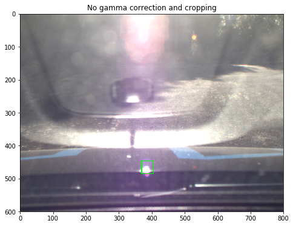
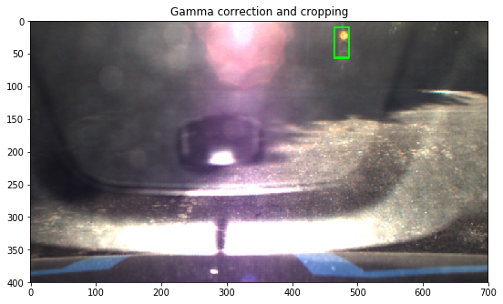
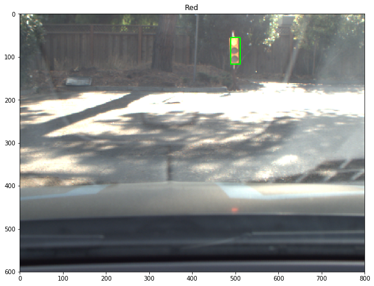
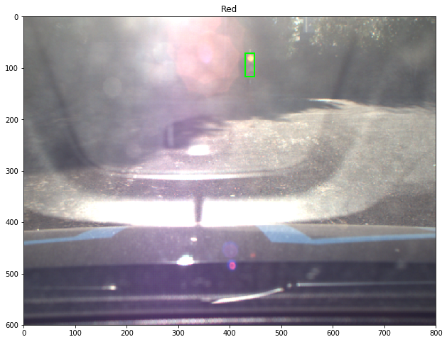
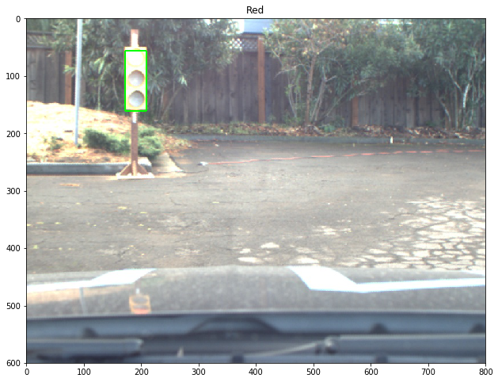
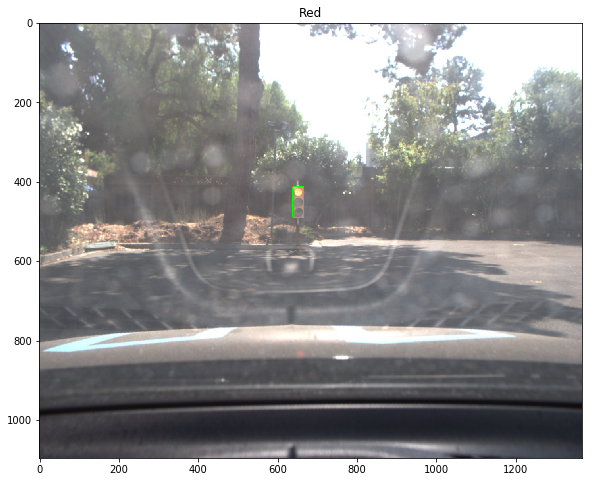

In our previous submission, we took a two-stage deep learning based approach in traffic light classification. That is, with two separate modules in tandem, we first detect (localize) the  traffic light(s) in an image (frame) (localization) and then input the cropped traffic light image to a CNN based classifier. For the detector part, we used TensorFlow Object Detection API, specifically ```ssd_mobilenet_v1_coco``` (developed with  Single Shot Multibox Detection (SSD) framework and COCO image datasets). During our initial submission, we found this model sufficiently met our needs, achieving the balance between good box accuracy (with the lighting condition and camera configuration at during September and October 2017) and fast running time. 

However, in the subsequent submissions, we found out the `ssd_mobilenet_v1_coco` as a general-purpose detection model (not optimized specifically for traffic light detection), does not generalize well when the lighting condition deviates from that of the training images. For example, the very saturated light condition (with glare and reflection, as shown in the following test site Images from late November 2017) could easily throw off the detector. This led to miss-detection, false-positive, or inaccurate bounding boxes, which in turn gave rise to erroneous classification results.



We tried some tricks to alleviate the hard lighting conditions, such as Gamma Correction technique and cropping. Though these approaches reduced the miss-detection and improve bounding box accuracy to a certain degree, it also could lead to overfitting or an increase in false-positives, should the lighting condition at the test site change again. 




To address the above mentioned issues, we decided to make two design changes in this iteration:

1) Instead of using a general purpose detector, we optimized the ```ssd_mobilenet_v1_coco ``` specific for traffic light detection (in the test site).

2) Instead of a two-stage approach, we opt for an end-to-end one-shot approach that provide both bounding box and classification results as outputs.

To this end, we selected a total about 300 test site images with various lighting conditions and camera configurations. We manually label the bounding box and light colors using [labelImg](https://github.com/tzutalin/labelImg). That is, we optimized an SSD detector for localizing and classifying Red, Green, and Yellow traffic light. We follow steps listed in the blog post [Tracking Custom Objects Intro - Tensorflow Object Detection API Tutorial] (https://pythonprogramming.net/custom-objects-tracking-tensorflow-object-detection-api-tutorial/) and trained for >12,000 global steps (this on average took about 12 hours on a MacBook Pro). Our initial assessments show that the one-shot detector can perform very well even in some very challenging lighting conditions, as shown in the following. 







